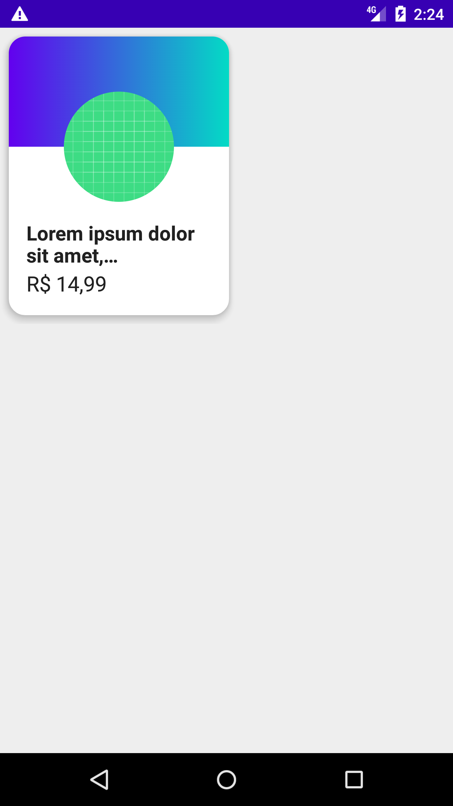
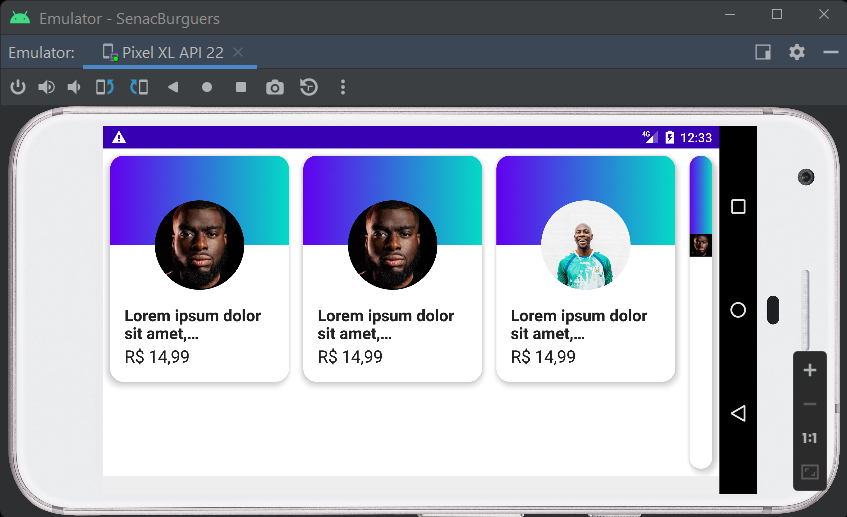
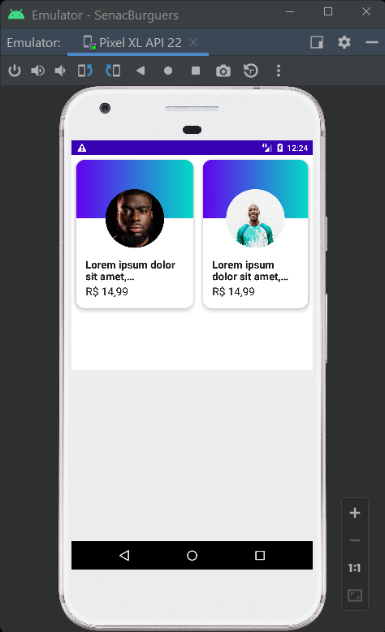

# SenacBurguers
Exemplo de composição com JETPACKCOMPOSE BASIC

Este é o nosso primeiro Componente o Círculo que já é uma Imagem em forma de compose
na próxima versão terá seu conteúdo atualizado através da biblioteca Coil que pertence ao próprio
jetpackcompose

coil o homem mola ==> https://youtu.be/sMRfYb6ZEhI?t=116

evoluindo para :

